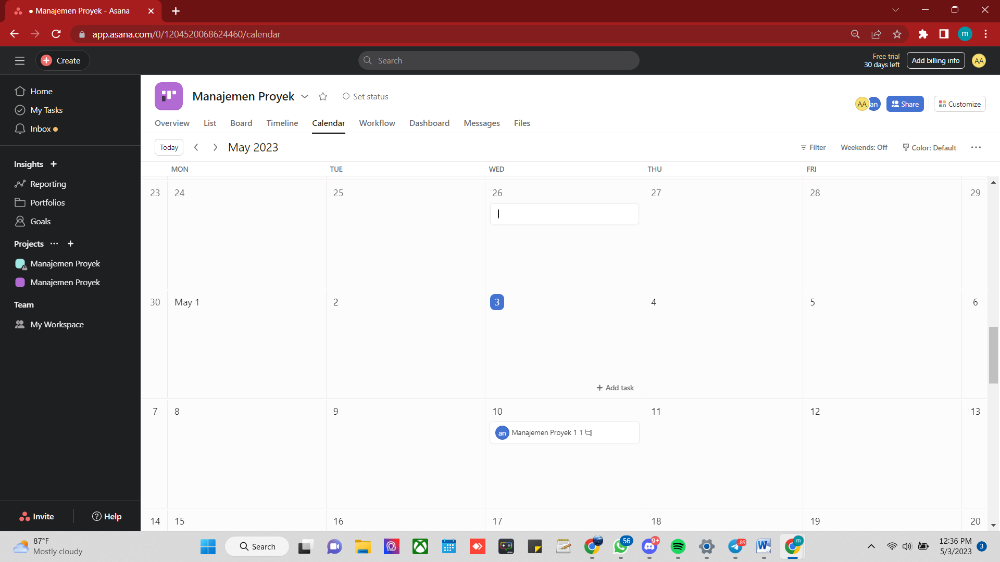

# Asana-Tool-Manajemen-Projek-
by Anneke Shavira M. [19081010041]

# Melakukan Manajemen Projek dengan Asana
## I. Tentang Asana

Asana merupakan tool manajemen proyek yang digunakan untuk mengorganisasikan pekerjaan yang kita lakukan secara individu maupun berkelompok (dengan tim). Tool ini dibangun oleh Duston Moskovitz yang merupakan co-founder facebook dan Justin Rosenstein yang merupakan tech lead and engineering manager of facebook. MEreka merekrut para developer dari google untuk ikut membangu asana.
Asana memiliki fitur fitur penting sebagai berikut :

**a.	Timeline**

Timeline digunakan untuk memetakan rancangan projek yang sedang dilakukan baik secara individu maupun berkelompok atau dengan tim. Pekerjaan yang dilakukan pun bisa dibagikan juga kepada rekan sesame tim ataupun orang lain.

**b.	Portopolio**

Portopolio berfungsi untuk melacak semua proyek yang dilakukan oleh tim. Fitur ini juga digunakan untuk memberikan gambaran erhadap progress proyek secara realtime.

**c.	Workload**

Workload digunakan untuk menggambarkan kapasitas kerja tiap orang. Fotur ini juga bisa digunakan untuk memberika target di masing masing tugas dan memberikan perkiraan pada tim yang memiliki beban kerja terlalu sedikit atau banyak.

## II. Cara Kerja Asana

**1.	Akses awal**

Pada penggunaan tool “asana” kita dapat menuju ke website resmi asana yaitu di https://app.asana.com/ dan apabila belum memiliki akun, kita dapat membuat akun terlebih dahulu, kita juga dapat mendaftar menggunakan alamat email yang kita miliki dengan memasukkannya pada form email di bawah ini dan klik signup.

Gambar 2.1 - Halaman awal website asana

**2.	Verifikasi email address**

Setelah melakukan login, kita dapat melakuka verifikasi email address melalui email yang telah di daftarkan. Kita hanya perlu mengeklik “verify email address”.

Gambar 2.2 – Verifikasi email address melalui gmail

**3.	Setup Account**

Setelah melakukan verifikasi email, kita dapat kembali menuju halaman resmi asana yaitu di app.asana.com/ID/account_setup. Selanjutnya, kita mengisi form nama pada “What’s y our full name ?” dan mengisi form password pada “Password” lalu pilih continue

Gambar 2.3 – Proses setup account pada asana

**4.	Mengisi primary role, bidang dan objek kerja**

Setelah mengisi nama dan password, kita diharuskan untuk memilih role kita sebagai pengguna, contohnya “student”.  Role merupakan kedudukan atau bisa dikatakan sebagai status pekerjaan yang sedang kita jalani saat ini. Semisal kita adalah siswa, maka kita dapat memilih “student”.  Lalu selanjutnya kita juga harus memilih jenis pekerjaan atau lebih tepatnya mau digunakan seperti  dan untuk apa tool ini. 

Gambar 2.4 – Mengatur role pada proses setup account asana

 

Gambar 2.5 – Mengatur jenis pekerjaan akan dilakukan pada asana

Pada “What is your main objective”, kita dapat memilih sesuai dengan projek yang akan kita kerjakan. Semisal kita ingin untuk melakukan projek dan manajemen proses dengan tim kita, opsi “project and process management” dapat kita pilih. Setiap tahap yang kita lalui kita akan memilih continue untuk menuju step berikutnya.

 

Gambar 2.6 – Mengatur main objective pada asana

**5.	Mengatur projek pertama**

Setelah melakukan serangkaian tahapan, mari kita mengatur projek pertama kita. Kita akan memberikan nama pada projek pertama kita. Setelah itu, jangan lupa untuk memilih continue untuk menuju tahapan yang berikutnya.

Gambar 2.7 – Setup projek pertama di asana

**6.	Memilih Layout untuk projek**

Kita akan memilih layout apa yang sesuai dan efektif untuk manajemen proses kerja yang akan kita lakukan. Disini terdapat layout dalam bentuk board, list, timeline dan calendar. Kita akan memilih salah satu layout yang sesuai, lalu kita memilih continue dan kita akan dibawah menuju halaman yang bertuliskan “Get Asana for all your screen”. Lalu kita bisa memiilih “Skip for now”

 
 
Gambar 2.8 – Menentukan layout pada projek pertama yang di buat 

 
 
Gambar 2.9 – Tampilan setelah melakukan setup projek dan menentukan layout 

**7.	Membuat projek pertama**

Setelah memilih layout, kita akan dibawah ke halaman awal dan secara otomatis login pada akun yang telah kita buat. Setelah itu, pada opsi “My workspace” yang terletak pada sebelah kiri navbar, kita dapat memilih “create new project” untuk membuat projek pertama kita. 

 

Gambar 2.10 – Membuat projek baru melalui opsi my workspace 
Setelah itu kita dapat memilih opsi blank project untuk memulai sebuah projek kosongan. 

 
 
Gambar 2.11 – Create a new project pada asana 

**8.	Memberi judul dan akses awal pada projek.**

Setelah memilih “create new project”, kita akan memberikan nama projek dan mengubah pengaturan privacy ke “Public to My workspace” untuk membuat project secara public.

 
 
Gambar 2.12 – Memberikan judul dan akses awal pada asana 
Lalu kita dapat memilih “start adding tasks” dan klik “go to project” untuk masuk ke dalam akses manajemen projek.

 
 
Gambar 2.13 – Tampilan halaman setelah klik goto project

**9.	Mengatur projek pertama kita**

Kita dapat mengubah nama projek, tanggal batasan kapan diselesaikannya projek dan juga mengundang orang untuk berpartisipasi terhadap projek yang akan kita kerjakan.

 
 
Gambar 2.14 – Tampilan projek pertama dan pengubahan judul projek 
 
 
 
Gambar 2.15 – Penambahan tanggal batas pengerjaan projek 

Gambar 2.16 – Menambahkan partisipan terhadap projek yang sedang dikerjakan.

**10.	Memberikan tanda pada projek yang sudah diselesaikan**

Apabila projek kita sudah selesai dikerjakan, kita dapat melakukan klik terhadap tanda centang yang ada di sebelah kiri card projek.

 
 
Gambar 2.17 – Memberikan tanda pada projek yang telah diselesaikan

**11.	Menggeser projek sesuai progress yang ada**

Kita dapat melakukan drag and drop pada card project sesuai dengan status progress pada projek yang berjalan. Apabila project sampai pada tahapan “in progress”, maka kita dapat menggeser card project kita pada tahapan tersebut.

 
 
Gambar 2.18 – Menggeser (drag and drop) projek ke kolom progress yang sesuai dengan status pengerjaan projek
 
 
 
Gambar 2.19 – Tampilan projek yang telah dipindahkan 

**12.	Mengubah tampilan pada manajemen projek**

Selain menggunakan tampilan board, kita juga dapat mengubahnya menjadi tampilan lain seperti list, calendar, timeline dan yang lainnya sesuai dengan kebutuhan yang diperlukan.

 
 
Gambar 2.20 – Mengubah tampilan pada manajemen projek ke tampilan yang lain

Kita juga dapat mengatur, menambahkan dan mengedit dan memindahkan projek pada tiap tampilan yang disediakan.

 
 
Gambar 2.21 – Mengubah tampilan pada manajemen projek menjadi list

 
 
Gambar 2.22 – Mengubah tampilan pada manajemen projek menjadi tampilan calendar

**13.	Membuat projek secara pribadi (private)**

Untuk membuat projek secara pribadi, kita dapat kembali ke halaman awal manajemen projek. Pada sebelah kiri navbar, terdapat opsi “my workspace” yang ada pada tahapan sebelumnya. Kita dapat memilih “create project”  untuk membuat projek baru.

 

Gambar 2.23 – Membuat projek secara  pribadi (private) pada asana

Lalu kita dapat memilih blank projek untuk memilih projek baru kosongan

 
 
Gambar 2.24 – Mengubah tampilan pada manajemen projek menjadi tampilan calendar

Pada halaman selanjutnya, kita akan diarahkan untuk menulis judul dan privacy projek. Pada projek yang ditetapkan secara privat, kita dapat memilih opsi “private to project members” lalu memilih opsi “continue”.
 
 
 
Gambar 2.25 – Menambahkan judul dan mengatur privacy project

Lalu pada halaman selanjutnya kita dapat memilih start adding task, dan opsi goto project. Maka tampilan yang akan muncul pada halaman selanjutnua adalah tampilan ploting progress projek seperti yang ada pada step nomor 9. Kita dapat mengatur nama  projek, tanggal batas pengerjaan projek sama seperti yang kita lakukan pada projek yang bersifat publik.

          

Gambar 2.2 6– Halaman setelah memilih goto project

